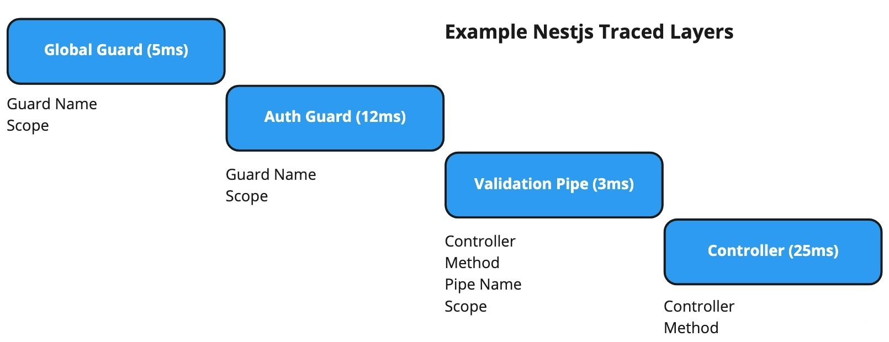

<p align="center">
  
</p>

<h1 align="center">NestJS OpenTelemetry</h1>
<p align="center">
<a href="https://www.npmjs.com/package/@easyv/nestjs-opentelemetry"> </a>
<a href="https://github.com/Yuuki-Sakura/Nestjs-OpenTelemetry"></a>
<a href="https://github.com/Yuuki-Sakura/Nestjs-OpenTelemetry"></a>
</p>

This library provides deeply integrated protocol-agnostic Nestjs [OpenTelemetry](https://opentelemetry.io/) instrumentations, metrics and SDK.

### Description

Nestjs is a protocol-agnostic framework. That's why this library can able to work with different protocols like RabbitMQ, GRPC and HTTP. Also you can observe and trace Nestjs specific layers like [Pipe](https://docs.nestjs.com/pipes), [Guard](https://docs.nestjs.com/guards), [Controller](https://docs.nestjs.com/controllers) and [Provider](https://docs.nestjs.com/providers).

It also includes auto trace and metric instrumentations for some popular Nestjs libraries.

- #### Distributed Tracing
  - [Setup](#distributed-tracing-1)
  - [Decorators](#trace-decorators)
  - [Trace Providers](#trace-providers)
  - [Auto Trace Instrumentations](#auto-trace-instrumentations)

OpenTelemetry Metrics currently experimental. So, this library doesn't support metric decorators and Auto Observers until it's stable. but if you want to use it, you can use OpenTelemetry API directly.

Only supports NestJS 9.x

### Installation
``` bash
npm install @easyv/nestjs-opentelemetry --save
```
***
### Configuration
This is a basic configuration without any trace and metric exporter, but includes default metrics and injectors
```ts
import { OpenTelemetryModule } from '@easyv/nestjs-opentelemetry'

@Module({
  imports: [
    OpenTelemetryModule.forRoot({
      serviceName: 'nestjs-opentelemetry-example',
    })
  ]
})
export class AppModule {}
```

Async configuration example (Not recommended, May cause auto instrumentations to not work)
```ts
import { OpenTelemetryModule } from '@easyv/nestjs-opentelemetry'
import { ConfigModule, ConfigService } from '@nestjs/config'

@Module({
  imports: [
    OpenTelemetryModule.forRootAsync({
      imports: [ConfigModule],
      useFactory: async (configService: ConfigService) => ({
        serviceName: configService.get('SERVICE_NAME'),
      }),
      inject: [ConfigService]
    })
  ]
})
export class AppModule {}
```
#### Default Parameters
| key               | value                                                                                                                                                                                                     | description                                                                                                                                                                                                                                                               |
|-------------------|-----------------------------------------------------------------------------------------------------------------------------------------------------------------------------------------------------------|---------------------------------------------------------------------------------------------------------------------------------------------------------------------------------------------------------------------------------------------------------------------------|
| traceInjectors    | DecoratorInjector, ScheduleInjector, ControllerInjector, GuardInjector, PipeInjector, InterceptorInjector, ExceptionFilterInjector, TypeormInjector, LoggerInjector, ProviderInjector, MiddlewareInjector | default auto trace instrumentations                                                                                                                                                                                                                                       |
| contextManager    | AsyncLocalStorageContextManager                                                                                                                                                                           | default trace context manager inherited from <a href="https://github.com/open-telemetry/opentelemetry-js/blob/745bd5c34d3961dc73873190adc763747e5e026d/experimental/packages/opentelemetry-sdk-node/src/types.ts#:~:text=NodeSDKConfiguration"> NodeSDKConfiguration </a> |
| instrumentations  | AutoInstrumentations                                                                                                                                                                                      | default instrumentations inherited from <a href="https://github.com/open-telemetry/opentelemetry-js/blob/745bd5c34d3961dc73873190adc763747e5e026d/experimental/packages/opentelemetry-sdk-node/src/types.ts#:~:text=NodeSDKConfiguration"> NodeSDKConfiguration </a>      |
| textMapPropagator | W3CTraceContextPropagator                                                                                                                                                                                 | default textMapPropagator inherited from <a href="https://github.com/open-telemetry/opentelemetry-js/blob/745bd5c34d3961dc73873190adc763747e5e026d/experimental/packages/opentelemetry-sdk-node/src/types.ts#:~:text=NodeSDKConfiguration"> NodeSDKConfiguration </a>     |

`OpenTelemetryModule.forRoot()` takes [OpenTelemetryModuleConfig](https://github.com/MetinSeylan/Nestjs-OpenTelemetry/blob/main/src/OpenTelemetryModuleConfig.ts#L25) as a parameter, this type is inherited by [NodeSDKConfiguration](https://github.com/open-telemetry/opentelemetry-js/blob/745bd5c34d3961dc73873190adc763747e5e026d/experimental/packages/opentelemetry-sdk-node/src/types.ts#:~:text=NodeSDKConfiguration) so you can use same OpenTelemetry SDK parameter.
***
### Distributed Tracing
Simple setup with Zipkin exporter, including with default trace instrumentations.
```ts
import { OpenTelemetryModule } from '@easyv/nestjs-opentelemetry'
import { OTLPTraceExporter } from '@opentelemetry/exporter-trace-otlp-grpc'
import { SimpleSpanProcessor } from '@opentelemetry/sdk-trace-base'

@Module({
  imports: [
    OpenTelemetryModule.forRoot({
      spanProcessor: new SimpleSpanProcessor(
        new OTLPTraceExporter({
          url: 'http://<collector-hostname>:<port>',
        })
      ),
    }),
  ],
})
export class AppModule {}
```
After setup, your application will be instrumented, so that you can see almost every layer of application in ZipkinUI, including Guards, Pipes, Controllers even global layers like this



List of supported official exporters [here](https://opentelemetry.io/docs/js/exporters/).
***
#### Trace Decorators
This library supports auto instrumentations for Nestjs layers, but sometimes you need to define custom span for specific method blocks like providers methods. In this case `@Trace` and `@TracePlain` decorator will help you.
```ts
import { Injectable } from '@nestjs/common'
import { Trace } from '@easyv/nestjs-opentelemetry'

@Injectable()
export class AppService {
  @Trace()
  getHello(): string {
    return 'Hello World!'
  }
}
```
Also `@Trace` decorator takes `name` field as a parameter
```ts
@Trace({ name: 'hello' })
```

***
#### Trace Providers
In an advanced usage case, you need to access the native OpenTelemetry Trace provider to access them from Nestjs application context.
```ts
import { Injectable } from '@nestjs/common'
import { Tracer } from '@opentelemetry/sdk-trace-base'

@Injectable()
export class AppService {
  constructor() {}

  getHello(): string {
    const span = trace.getTracer('default').startSpan('important_section_start')
    // do something important
    span.setAttributes({ userId: 1150 })
    span.end()
    return 'Hello World!'
  }
}
```
***
#### Auto Trace Instrumentations
The most helpful part of this library is that you already get all of the instrumentations by default if you set up a module without any extra configuration. If you need to avoid some of them, you can use the `traceAutoInjectors` parameter.
```ts
import { Module } from '@nestjs/common'
import {
  ControllerInjector,
  EventEmitterInjector,
  GuardInjector,
  LoggerInjector,
  OpenTelemetryModule,
  PipeInjector,
  ScheduleInjector,
} from '@easyv/nestjs-opentelemetry'
import { OTLPTraceExporter } from '@opentelemetry/exporter-trace-otlp-grpc'
import { SimpleSpanProcessor } from '@opentelemetry/sdk-trace-base'

@Module({
  imports: [
    OpenTelemetryModule.forRoot({
      traceInjectors: [
        ControllerInjector,
        GuardInjector,
        EventEmitterInjector,
        ScheduleInjector,
        PipeInjector,
        LoggerInjector,
      ],
      spanProcessor: new SimpleSpanProcessor(
        new OTLPTraceExporter({
          url: 'http://<collector-hostname>:<port>',
        })
      ),
    }),
  ]
})
export class AppModule {}
```

#### List of Trace Injectors
| Instance                  | Description                                                                                                          |
|---------------------------|----------------------------------------------------------------------------------------------------------------------|
| `ControllerInjector`      | Auto trace all of module controllers                                                                                 |
| `DecoratorInjector`       | Auto trace all of decorator providers                                                                                |
| `GuardInjector`           | Auto trace all of module guards including global guards                                                              |
| `PipeInjector`            | Auto trace all of module pipes including global pipes                                                                |
| `InterceptorInjector`     | Auto trace all of module interceptors including global interceptors                                                  |
| `ExceptionFilterInjector` | Auto trace all of module exceptionFilters including global exceptionFilters                                          |
| `MiddlewareInjector`      | Auto trace all of module middlewares including global middlewares                                                    |
| `ProviderInjector`        | Auto trace all of module providers                                                                                   |
| `ScheduleInjector`        | Auto trace for [@nestjs/schedule](https://docs.nestjs.com/techniques/task-scheduling) library, supports all features |
| `LoggerInjector`          | [Logger](https://docs.nestjs.com/techniques/logger#using-the-logger-for-application-logging) class tracer            |
| `TypeormInjector`         | Auto trace for [typeorm](https://github.com/typeorm/typeorm) library                                                 |
***
